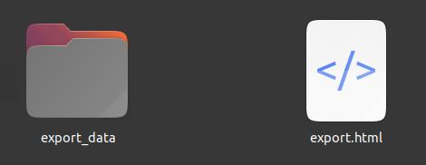
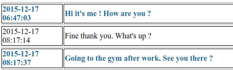

# export-sms-thread-to-html

Export a clean human readable HTML page from a SMS export. The export has to be made by [SMS Import / Export ](https://github.com/tmo1/sms-ie). The zip file must be extracted on the computer.

MMS are converted to simple text. Images are copied to a directory `export_data` next to the html page.

## Installation 

```shell

cd ~
git clone https://gitea.nacq.me/nicolas/export-sms-thread-to-html.git
export-sms-thread-to-html

```

## Usage

```shell
cd ~/export-sms-thread-to-html
php export-sms-thread-to-html.php [params]
```

### Params
 - path to the dir containing messages.ndjson file
 - part of the phone number (or thread-id)
 - HTML file output path
 - date from : optional
 - date to : optional

### Example
```shell
cd ~/export-sms-thread-to-html


# export all message from thread 6
php export-sms-thread-to-html.php ~/downloads/export/ 601234567 export.html

# export all messages after 2023-05-07
php export-sms-thread-to-html.php ~/downloads/export/ 601234567 export.html 2023-05-07 

# export year 2022
php export-sms-thread-to-html.php ~/downloads/export/ 601234567 export.html 2022-01-01 2022-12-31 

# if there is multiple threads with the same number you have to choose one of them like this. (the thread-id will be provided by the script)
php export-sms-thread-to-html.php ~/downloads/export/ thread-194 export.html

```

### Phone number

Keep in mind that sometime numbers are stored like this `+33601234567`, sometime like this `0601234567`. You must enter just a part of the number. The last part. Like this : `01234567` or `601234567`. So that the correct thread can be found.

## result



