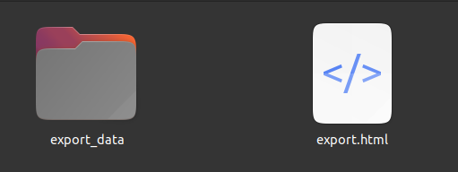

# export-sms-thread-to-html

Export a clean human readable HTML page from a SMS export. The export has to be made by [SMS Import / Export ](https://github.com/tmo1/sms-ie). The zip file must be extracted on the computer.

MMS are converted to simple text. Images are copied to a directory `export_data` next to the html page.

## Installation 

```shell

cd ~
git clone https://gitea.nacq.me/nicolas/export-sms-thread-to-html.git
export-sms-thread-to-html

```

## Usage

```shell
cd ~/export-sms-thread-to-html
php export-sms-thread-to-html.php [path to ndjson file] [path to data dir] [thread_id] [HTML file output path]
```

### Example
```shell
cd ~/export-sms-thread-to-html
php export-sms-thread-to-html.php ~/downloads/export/messages.ndjson ~/downloads/export/messages-2023-09-18/data/ 6 export.html
```

### Thread id

You must open the `.ndjson` file in your export directory. You search a phone number. At the begining of the line, you'll find the `thread_id` corresponding to the thread with this number.

## result



